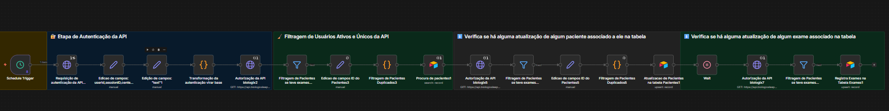

# Sincronização Biologix-Airtable - Automação de Sincronização de Dados Médicos

## 📋 Visão Geral

Esta automação sincroniza dados de exames de ronco e sono da API Biologix com o Airtable, mantendo informações atualizadas de pacientes e seus exames. O workflow executa diariamente às 8h e verifica se há novos exames concluídos ou atualizações de pacientes.

## 🎯 Objetivo

- Sincronizar dados de pacientes da API Biologix para o Airtable
- Atualizar informações de exames concluídos
- Manter histórico completo de exames por paciente
- Evitar duplicação de registros

## 📊 Fluxo do Workflow

### Fluxo Detalhado:

1. **Schedule Trigger** → Dispara diariamente às 8h
2. **Autenticação API Biologix** → Obtém token de acesso
3. **Busca de Exames** → Lista exames com status concluído (status = 6)
4. **Filtragem e Processamento** → Remove duplicados e processa dados
5. **Busca de Pacientes no Airtable** → Verifica se paciente já existe
6. **Atualização/Criação** → Atualiza ou cria registros no Airtable
7. **Processamento de Exames** → Para cada paciente, busca exames associados
8. **Registro de Exames** → Salva exames na tabela de Exames

## 🔧 Nodes Utilizados

### 1. Schedule Trigger
- **Tipo:** `n8n-nodes-base.scheduleTrigger`
- **Função:** Dispara o workflow diariamente às 8h
- **Configuração:** Intervalo diário com trigger às 8h

### 2. Requisição de Autenticação da API Biologix1
- **Tipo:** `n8n-nodes-base.httpRequest`
- **Função:** Autentica na API Biologix usando credenciais
- **Método:** POST
- **Endpoint:** `https://api.biologixsleep.com/v2/sessions/open`
- **Retorna:** `userId`, `sessionId`, `token`

### 3. Edição de Campos: userId, sessionID, centerID, token1
- **Tipo:** `n8n-nodes-base.set`
- **Função:** Extrai e organiza dados de autenticação
- **Campos extraídos:**
  - `userId`
  - `sessionID`
  - `centerID` (fixo: 4798042LW)
  - `token` (do header `bx-session-token`)

### 4. Edição de Campos: "text"1
- **Tipo:** `n8n-nodes-base.set`
- **Função:** Prepara string para autenticação Basic
- **Formato:** `userId:token`

### 5. Transformação da Autenticação virar base
- **Tipo:** `n8n-nodes-base.code`
- **Função:** Converte credenciais para Base64 (Basic Auth)
- **Código:** `Buffer.from($json["text"]).toString('base64')`

### 6. Autorização da API biologix2
- **Tipo:** `n8n-nodes-base.httpRequest`
- **Função:** Busca lista de exames da API
- **Método:** GET
- **Endpoint:** `https://api.biologixsleep.com/v2/partners/4798042LW/exams`
- **Headers:** Authorization Basic (Base64)

### 7. Filtragem de Pacientes se teve exames concluidos3
- **Tipo:** `n8n-nodes-base.filter`
- **Função:** Filtra apenas exames com status = 6 (concluído) e status ≠ 400 (erro)

### 8. Edição de Campos ID do Pacientes3
- **Tipo:** `n8n-nodes-base.set`
- **Função:** Extrai ID do paciente do exame
- **Campo:** `ID do Paciente` = `patientUserId`

### 9. Filtragem de Pacientes Duplicados3
- **Tipo:** `n8n-nodes-base.code`
- **Função:** Remove pacientes duplicados baseado no nome
- **Lógica:** Usa Set para garantir unicidade

### 10. Procura de pacientes1
- **Tipo:** `n8n-nodes-base.airtable`
- **Função:** Busca paciente no Airtable pelo nome
- **Operação:** Search
- **Tabela:** Pacientes
- **Filtro:** `{Nome} = '{{ $json.issuedBy.name }}'`

### 11. Autorização da API biologix5
- **Tipo:** `n8n-nodes-base.httpRequest`
- **Função:** Busca exames específicos de um paciente
- **Endpoint:** `https://api.biologixsleep.com/v2/partners/4798042LW/exams`
- **Headers:** Authorization Basic

### 12. Filtragem de Pacientes se teve exames concluidos7
- **Tipo:** `n8n-nodes-base.filter`
- **Função:** Filtra exames com status = 6 (concluído)
- **Condição:** `status === 6`

### 13. Edição de Campos ID do Pacientes5
- **Tipo:** `n8n-nodes-base.set`
- **Função:** Extrai ID do paciente e data de nascimento
- **Campos:** `ID do Paciente`, `Data de Nascimento`

### 14. Filtragem de Pacientes Duplicados5
- **Tipo:** `n8n-nodes-base.code`
- **Função:** Remove duplicados baseado em `patientUserId`
- **Lógica:** Usa Set para garantir unicidade

### 15. Atualização de Pacientes na tabela Pacientes1
- **Tipo:** `n8n-nodes-base.airtable`
- **Função:** Atualiza ou cria registro de paciente
- **Operação:** Upsert
- **Tabela:** Pacientes
- **Campos mapeados:**
  - ID do Paciente, Nome, Status, Sexo, Email
  - Data de Nascimento, Telefone, username
- **Matching:** Por `ID do Paciente`

### 16. Wait
- **Tipo:** `n8n-nodes-base.wait`
- **Função:** Aguarda 30 segundos antes de buscar exames
- **Motivo:** Evitar rate limiting da API

### 17. Autorização da API biologix7
- **Tipo:** `n8n-nodes-base.httpRequest`
- **Função:** Busca exames do paciente após atualização
- **Endpoint:** `https://api.biologixsleep.com/v2/partners/4798042LW/exams`
- **Headers:** Authorization Basic + X-Pagination-Limit: 1

### 18. Filtragem de Pacientes se teve exames concluidos6
- **Tipo:** `n8n-nodes-base.filter`
- **Função:** Filtra exames válidos (status ≠ 2, 5, 7)
- **Condição:** Exclui status de erro ou cancelado

### 19. Registra Exames na Tabela Exames1
- **Tipo:** `n8n-nodes-base.airtable`
- **Função:** Salva dados completos do exame
- **Operação:** Upsert
- **Tabela:** Exames
- **Campos mapeados (exemplos):**
  - Dados básicos: ID Exame, Type, Duração, Peso, Altura
  - Dados de Ronco: Duração, Silêncio, Baixo, Médio, Alto
  - Dados de Oximetria: IDO, spO2, BPM, Latência, Eficiência do Sono
  - Dados clínicos: Sintomas, Doenças, Remédios, Tratamentos
  - Metadados: Serial Aparelho, Data de Processamento, Resultado
- **Matching:** Por `ID Exame`

## 🔌 Integrações Externas

### API Biologix Sleep
- **Tipo:** API REST
- **Autenticação:** Basic Auth (Base64)
- **Endpoints utilizados:**
  - `/v2/sessions/open` - Autenticação
  - `/v2/partners/{centerID}/exams` - Lista de exames
- **Dados extraídos:**
  - Informações de pacientes
  - Dados completos de exames (ronco, oximetria, sono)
  - Metadados e resultados

### Airtable
- **Tipo:** Base de dados no-code
- **Autenticação:** Personal Access Token
- **Tabelas utilizadas:**
  - **Pacientes:** Dados demográficos e clínicos
  - **Exames:** Dados detalhados de cada exame
- **Operações:**
  - Search: Busca pacientes existentes
  - Upsert: Atualiza ou cria registros

## 📈 Dados Processados

### Tabela Pacientes
- ID do Paciente (chave única)
- Nome, Email, Telefone
- Sexo, Data de Nascimento
- Status do exame
- Username

### Tabela Exames
- ID Exame (chave única)
- ID Paciente (relacionamento)
- Dados de Ronco (duração, intensidade)
- Dados de Oximetria (IDO, spO2, BPM)
- Dados de Sono (latência, eficiência, duração)
- Dados Clínicos (sintomas, doenças, remédios)
- Metadados (data, modelo do aparelho, resultado)

## ⚙️ Lógica de Negócio

1. **Prevenção de Duplicatas:**
   - Filtra pacientes únicos antes de processar
   - Usa Upsert no Airtable para atualizar existentes

2. **Filtragem de Status:**
   - Processa apenas exames concluídos (status = 6)
   - Ignora exames com erro (status = 400)

3. **Rate Limiting:**
   - Aguarda 30 segundos entre requisições de exames
   - Usa paginação (limit = 1) para controlar volume

4. **Relacionamento:**
   - Mantém vínculo entre Pacientes e Exames
   - Atualiza pacientes antes de processar exames

## 🚀 Execução

- **Frequência:** Diária às 8h
- **Duração estimada:** 2-5 minutos (dependendo do volume)
- **Tratamento de erros:** Retry automático configurado

## 📝 Notas Técnicas

- O workflow usa `executeOnce: true` em alguns nodes para otimização
- Credenciais são armazenadas no n8n (não expostas no código)
- O workflow processa exames em lote, mas com controle de duplicatas
- Dados sensíveis (senhas, tokens) foram removidos do código
